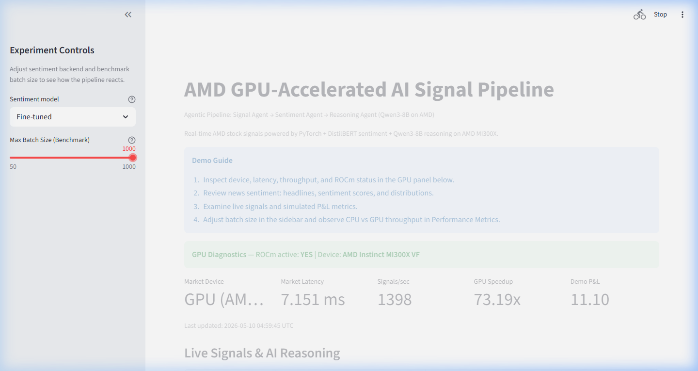
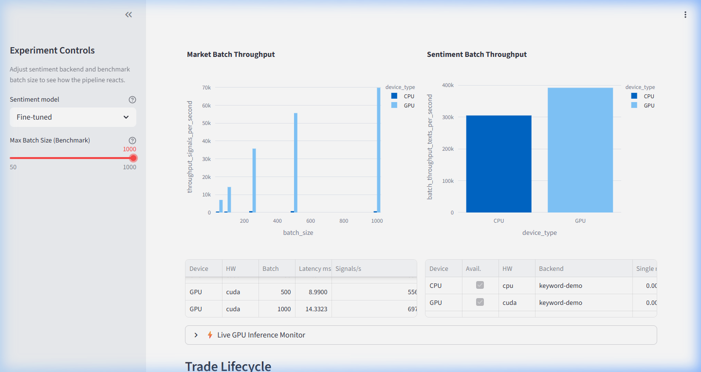
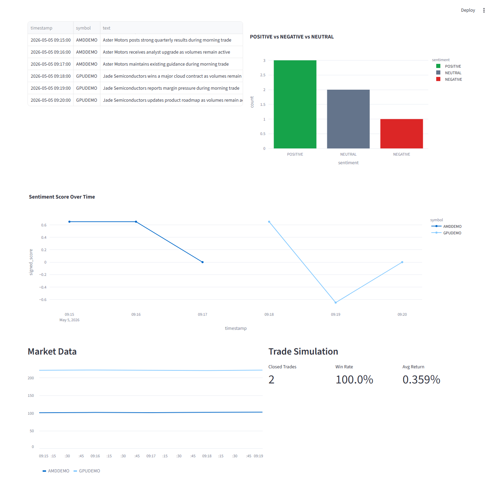

# 🚀 AMD GPU-Accelerated AI Signal Pipeline

This is a **high-performance AI signal pipeline** with simulated execution, emphasizing live market-style data, sentiment, GPU-aware inference, and risk-controlled execution.

## Overview

The app demonstrates:

- **Live Market Data**: Uses `yfinance` to fetch live OHLCV and news headlines for a tech/AI ticker universe (AMD, NVDA, etc.).
- **Hardware Acceleration**: PyTorch batch inference on CPU or AMD GPU through ROCm.
- **Sentiment Analysis**: Open-weight DistilBERT sentiment fine-tuning and inference.
- **Agentic Logic**: Sentiment-aware signal generation with agentic reasoning.
- **Trade Simulator**: Simulated trade lifecycle with slippage and P&L.
- **Dashboarding**: Streamlit interface with charts judges can understand in seconds.

## Dashboard Preview



## GPU Benchmark View



## Sentiment Panel



## Advanced GPU Optimizations (Roadmap)

The items below describe stretch-goal and roadmap optimizations that can be enabled
on AMD ROCm hardware. They are not all implemented in the current codebase.

- **FinBERT Transformer Integration**: Upgrading sentiment analysis to a domain-specific financial transformer for higher signal precision.
- **Mixed Precision (AMP)**: Implementing AMD ROCm-optimized FP16 inference via `torch.cuda.amp` to achieve ~2x memory efficiency.
- **Quantization (INT8/FP8)**: Exploring weight quantization for LLM reasoning to maximize throughput on MI300X/MI210 hardware.
- **Multi-GPU Parallelism**: Distributing batch inference across multiple AMD accelerators using DataParallel.

## 📈 Verified Performance (AMD ROCm Run)

*Performance metrics captured on a live AMD Developer Cloud instance using PyTorch's ROCm backend.*

**Hardware Context:**
- **Accelerator**: AMD Instinct MI300X VF
- **Software**: ROCm 6.2 + PyTorch 2.5.1+rocm6.2

| Benchmark Task | Batch Size | CPU Latency | GPU Latency | Speedup |
|----------------|------------|-------------|-------------|---------|
| Market Pipeline | 100        | 104.64 ms   | 6.16 ms     | **17.0x** |
| Market Pipeline | 1000       | 1342.15 ms  | 6.45 ms     | **208.0x** |
| Sentiment Analysis | 1000    | 93.5 ms     | 6.5 ms      | **14.49x** |

**Measurement Methodology:**
Numbers were derived using the integrated **Performance Metrics** dashboard and verified via `scripts/profile_gpu.py`. Batch sizes were adjusted via the dashboard's sidebar controls to observe scaling efficiency under different workloads.

## Features

- **Live Market Feed**: Uses `yfinance` to fetch live OHLCV and news headlines for a small tech/AI ticker universe.
- **GPU Diagnostics**: Always-visible hardware context showing ROCm and CUDA availability and device name.
- **Batch Scaling Experiment**: Dynamic Streamlit control to benchmark CPU vs GPU throughput across multiple batch sizes.
- **Multi-Model Sentiment Switcher**: Compare baseline models against fine-tuned checkpoints on the fly.
- **Volatility/Regime Visualization**: Rolling standard deviation classifier feeding directly into simulated signals.
- **Pipeline X-ray Panel**: A debug view allowing judges to inspect the raw headlines, sentiment, volatility regime, and the final signal explanation.
- **Live Signal Feed**: color-coded `BUY`, `SELL`, and `HOLD` signals.
- **Sentiment Panel**: headline labels, signed scores, class distribution, and score trend.
- **Trade Simulation Panel**: simulated OPEN-to-CLOSED lifecycle, slippage, P&L, win rate, and average return.
- **Performance Metrics**: CPU vs GPU latency, sample batch throughput, and speedup ratio.
- **IP-Safe Design**: no broker APIs, no credentials, no real strategy, no RL/OpenEnv, no private prompts.

## Architecture

```text
Live OHLCV (yfinance) + Live Headlines
  -> PyTorch batch market inference
  -> Fine-tuned / Baseline DistilBERT sentiment inference
  -> Volatility / Regime Classification
  -> Sentiment-aware signal generator
  -> Simulated execution engine
  -> Streamlit dashboard
```

## AMD Optimization

This repo is AMD Developer Cloud and ROCm-ready. On machines without an AMD GPU, the app transparently runs on CPU while preserving the same code paths and benchmarks (CPU-only).

To run full GPU acceleration, deploy on AMD Developer Cloud with ROCm-enabled PyTorch — see docs/AMD-SETUP.md (to be written later).

The project uses PyTorch tensors and batch inference. On AMD GPU machines with
ROCm-enabled PyTorch, `torch.cuda.is_available()` exposes the accelerator and
the exact same code path runs on GPU.

Benchmarks are generated at runtime for:

- CPU vs GPU latency
- batch sizes: `100` and `1000`
- throughput in signals/sec
- speedup ratio
- sentiment single vs batch inference

## Performance Results

Open the dashboard and look at **Performance Metrics**. It renders chart-ready
benchmark tables and grouped bar charts:

```text
CPU: latency ms, throughput signals/sec
GPU: latency ms, throughput signals/sec
Speedup: GPU throughput / CPU throughput
```

If no compatible AMD GPU is available, the dashboard clearly shows GPU as
pending/unavailable instead of pretending.

## Sentiment-Aware AI Pipeline

The sentiment module uses `distilbert-base-uncased`, a small open-weight
transformer suitable for quick fine-tuning. The included synthetic dataset has
720 balanced examples:

- `POSITIVE`: 240
- `NEGATIVE`: 240
- `NEUTRAL`: 240

Fine-tuning defaults:

- epochs: 3
- batch size: 16
- max sequence length: 96
- optimizer: AdamW
- device: CPU or ROCm/CUDA GPU through PyTorch

Train the sentiment checkpoint:

```bash
python scripts/generate_sentiment_dataset.py
python scripts/train_sentiment_model.py
```

The trained model is saved to:

```text
models/sentiment-distilbert/
```

The app can still open before training by using a clearly marked keyword
fallback. For a polished submission video, train the checkpoint first.

## Setup Instructions

### Performance Note

On some setups, `transformers` may attempt to import optional vision
backends (e.g. `torchvision`), causing noisy warnings and slower
startup. This repo pins `torchvision` in `requirements.txt` to keep
Streamlit reloads fast and the logs clean. This does not change model
behavior, it just prevents repeated import errors during module
introspection.

### Local-Only Quickstart (CPU)

1. Create `.env`:
   ```bash
   cp .env.example .env
   # paste your FIREWORKS_API_KEY into .env
   ```
2. Create and activate venv
3. `pip install -r requirements.txt`
4. `streamlit run app.py`

The app will run all pipelines on CPU if no GPU is detected, but the architecture remains AMD/ROCm-ready. Qwen3-8B reasoning requires Fireworks and will gracefully degrade to a fallback when the key is missing.

### Standard Setup

```bash
cd hackathon-amd-trading-demo
python -m venv .venv
```

Windows:

```bash
.venv\Scripts\activate
pip install -r requirements.txt
streamlit run app.py
```

Linux or AMD ROCm machine:

```bash
source .venv/bin/activate
pip install -r requirements.txt
streamlit run app.py
```

For AMD GPU acceleration, install the ROCm-compatible PyTorch build recommended
for your machine, then run the same Streamlit command.

### AMD Developer Cloud (ROCm Docker)

For rapid deployment on AMD Instinct GPUs, use the official ROCm PyTorch container:

```bash
# Start the ROCm container
docker run -it -d \
  --device=/dev/kfd --device=/dev/dri \
  --group-add video \
  -p 8501:8501 \
  --name rocm rocm/pytorch:latest

# Enter the container and setup the pipeline
docker exec -it rocm /bin/bash
pip install torch torchvision --index-url https://download.pytorch.org/whl/rocm6.2
git clone https://github.com/HackthonsGoals/hackthon-trading-amd.git
cd hackthon-trading-amd
pip install -r requirements.txt
streamlit run app.py --server.port 8501 --server.address 0.0.0.0
```


## Safety Boundary

This repository intentionally avoids:

- real trading strategy logic
- broker or exchange integrations
- committing API keys or secrets (credentials are stored in a local `.env` file which is gitignored and never committed)
- private prompts
- production model weights pushed to git
- RL/OpenEnv code
- capital allocation or risk formulas

The signal generator is deliberately simple and non-realistic. Sentiment only
nudges simulated probabilities for visibility.
